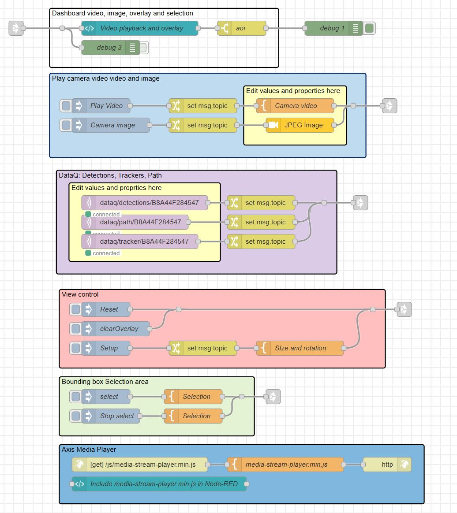
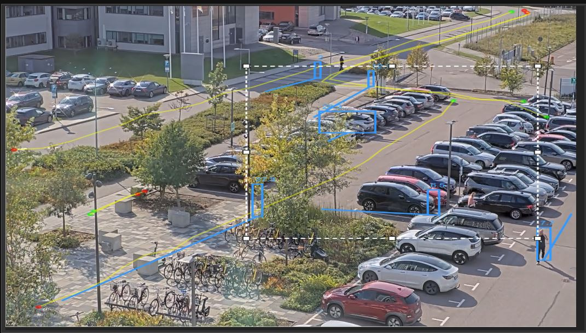

# Dashboard video and object-analytics visualization

A dashboard flow for playing live video from an Axis camera with the ability to visualize object-detection-analytics from [DataQ ACAP](https://pandosme.github.io/acap/2025/01/18/DataQ.html).  A user-select-area is also supported when needing to build a dashboard where user defines an area (e.g. filtering).  
The flows are just demonstrator.  The idea is to customize the flows to fit your needs.  

For visualizing object-detection-motion you will need to have installed DataQ ACAP in the camera and an MQTT Broker.
 
***

## Usage

1. **Install Required Node**  
   - Use the palette manager in Node-RED to install:  
     [node-red-dashboard](https://flows.nodered.org/node/node-red-dashboard)

2. **Import the Flow**  
   - Download [`flows.json`](./flows.json)
   - In Node-RED, use menu: `Import` > paste JSON or upload file

3. **Modify the flow for your environment**  
   - Double-click all the nodes in the yellow groups marked "Edit values and properties here "to set address, accounts, MQTT settings.

4. **Inject the flows you want to run**  
   Click injects nodes on what you want to test.

5. **Go to the Node-RED UI**  

***
## Screenshot of the flows

## Screenshot of dashboard

***
