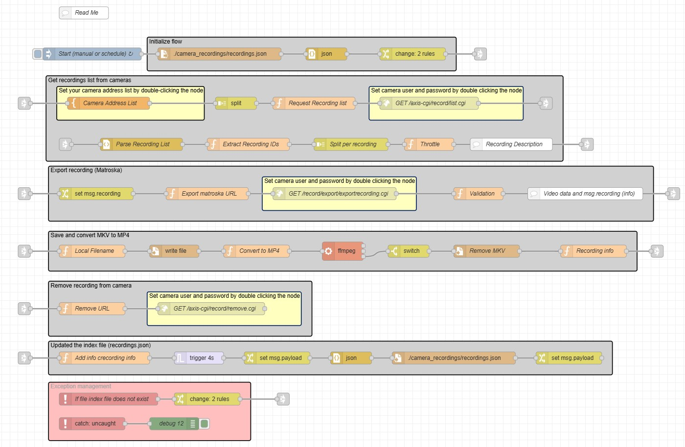

# Export SD Recordings to Local MP4

Automatically fetches video recordings stored on Axis cameras, saves them to local disk, converts MKV files to MP4 using `ffmpeg` (via Node-RED’s built-in exec node), removes recordings from the camera, and updates a local `recordings.json` index file.

***

## Usage

1. **Install Required Software**  
   - **Node-RED** must be installed and running.
   - **ffmpeg** must be available in your system's PATH (for video conversion).  
     To install on Ubuntu/Debian:  
     ```sh
     sudo apt update
     sudo apt install ffmpeg
     ```
     To check installation:  
     ```sh
     ffmpeg -version
     ```

2. **Import the Flow**  
   - Download [`flows.json`](./flows.json)
   - In Node-RED, use menu: `Import` > paste JSON or upload file

3. **Edit Camera Addresses**  
   - Double-click the `Camera Address List` node
   - Enter an array of camera IP addresses (strings). Example:
     ```
     ["192.168.1.10", "192.168.1.11"]
     ```
   - The flow will process all specified cameras.

4. **Set Camera Credentials**  
   - Double-click the HTTP request nodes labeled ‘Set camera user and password by double clicking the node’
   - Enter the **username** and **password** needed for your Axis cameras

5. **Output Directory**  
   - Video files and the index will be stored in `./camera_recordings/`
   - Recordings are organized by date (subfolder per day, e.g. `YYYY-MM-DD/`), filenames use the recording start time.

***

## Requirements

- Node-RED
- Axis cameras with HTTP API enabled
- **ffmpeg** (installed via your OS, *not* via node-red-contrib-ffmpeg!)
- Appropriate filesystem permissions for saving files in the target directory

***



## Features

- **Automated Camera Polling:**  
  Checks each camera for new SD recordings.
- **Export & Archive:**  
  Downloads each camera recording as an MKV file to local disk.
- **Format Conversion:**  
  Converts MKV to MP4 using the system’s `ffmpeg` via Node-RED’s `exec` node.
- **Cleanup:**  
  When a recording is successfully converted, the flow deletes the MKV and removes the original recording from the camera.
- **Indexing:**  
  Updates `camera_recordings/recordings.json` with metadata about each exported file.
- **Throttling:**  
  By default, only processes up to 5 recordings concurrently (adjustable in Throttle node).
- **Robust Error Handling:**  
  Handles missing files and unforeseen errors; exceptions are logged in the Node-RED debug sidebar.

***

## Tips

- **Triggering:**  
  The flow can be started manually or on a schedule by configuring the “Start (manual or schedule)” node.
- **File and Folder Structure:**  
  Change the save location by editing the "Local Filename" function node if needed.
- **Permissions:**  
  Ensure Node-RED has sufficient permissions to write to `./camera_recordings`.

***

## Troubleshooting

- **No Recordings Found:**  
  Verify camera IP addresses and credentials.
- **Conversion Issues:**  
  Ensure ffmpeg is installed, and Node-RED has permission to execute it.
- **File Access Errors:**  
  Check permissions of `./camera_recordings/` and subfolders.

***

## Example Flow

The flow will:

1. Detect available recordings on each configured Axis camera
2. Download each as an MKV file, named and organized by date/time
3. Convert to MP4 using `ffmpeg`
4. Delete the original MKV file
5. Remove the recording from the camera
6. Log the new recording’s information in `./camera_recordings/recordings.json`

***
