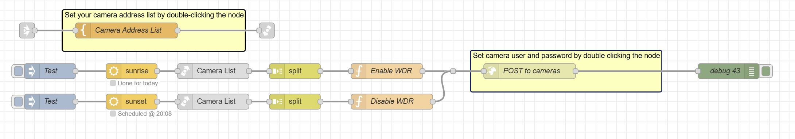

# Enable/Disable WDR on Sunrise/Sunset

Automatically enables Wide Dynamic Range (WDR) for Axis cameras at sunrise, and disables it at sunset. Ensures best video quality for changing lighting conditions.



---

## Usage

1. **Install Required Node**  
   - Use the palette manager in Node-RED to install:  
     `node-red-contrib-cb-suncron`

2. **Import the Flow**  
   - Download [`flow.json`](./flow.json)
   - In Node-RED, use menu: `Import` > paste JSON or upload file

3. **Edit Camera Addresses**  
   - Double-click the `Camera Address List` node  
   - Enter an array of camera IP addresses (strings), e.g.:  
     ```
     ["192.168.1.10", "192.168.1.11"]
     ```

4. **Set Camera Credentials**  
   - Double-click the HTTP node labelled `POST to cameras`
   - Enter the **username** and **password** needed for your Axis cameras


---

## Requirements

- Node-RED
- [node-red-contrib-cb-suncron](https://flows.nodered.org/node/node-red-contrib-cb-suncron)
- Axis cameras with HTTP API enabled

---

